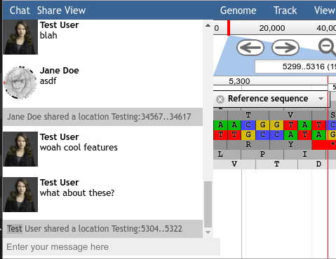

# JBrowse Chat Plugin

Currently very WIP, but I finally had a few moments alone and could implement this.

## Demo

[](https://www.youtube.com/watch?v=UZXsznS6LU0)

## Screenshot



## Feature List

If you think of other features you want, let me know.

Status | Feature
------ | -------
100%   | Google Login
100%   | Multiuser chat
50%    | Per-instance OR per-refseq rooms
75%    | Link to locations, Share Tracks, "Follow Mode" / Screensharing, "Go Back"
100%   | Path prefix
100%   | Ensure Cross Origin functionality
0%     | Fix CSS
0%     | Security Audit
0%     | Display user locations / update position regularly.

Wishlist?

- Comments wherever there is a popup
- Notifications
- Persistence

## Example configuration

```ini
[plugins.Chat]
location = plugins/Chat
server = http://localhost:5000
granularity = refseq
```

## LICENSE

AGPL-3.0
